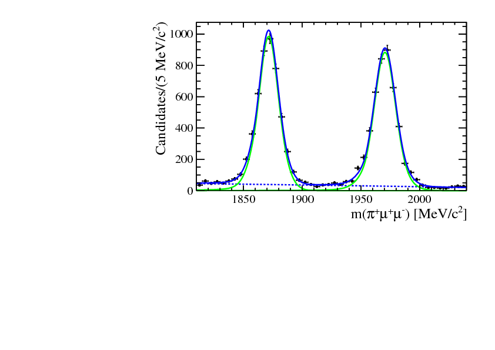
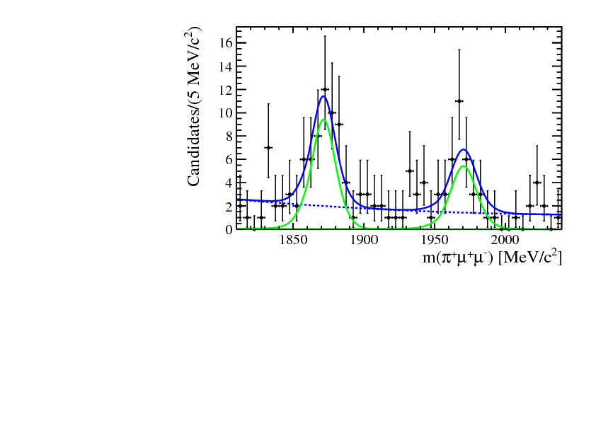
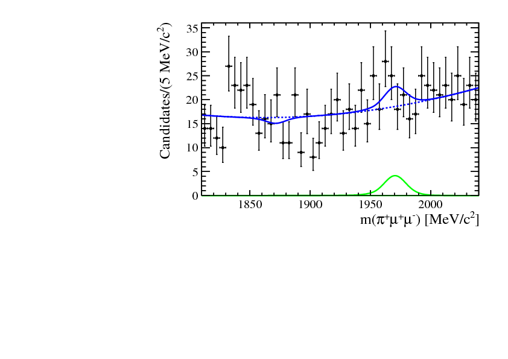
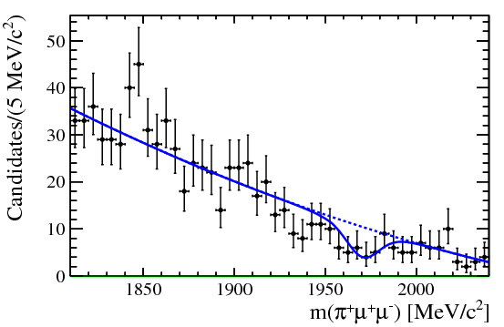
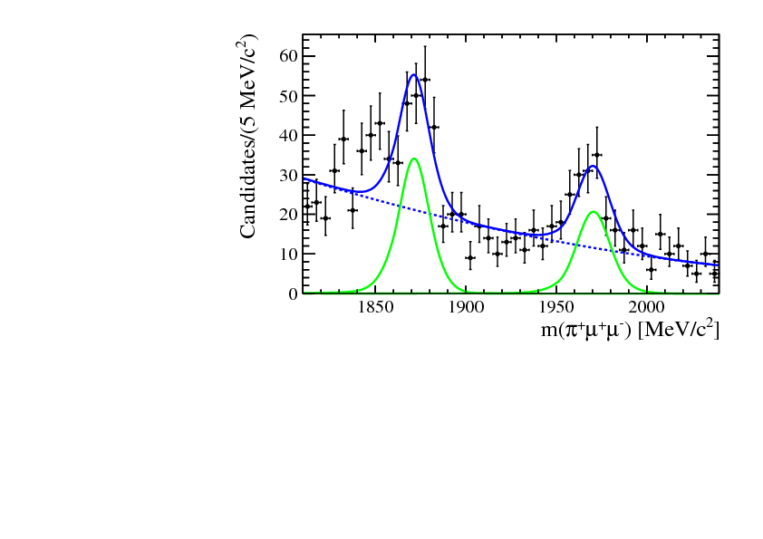

# REANA example - Search for the rare charm decays 

## About

This example is based on [analysis-case-study](https://github.com/atrisovic/analysis-case-study).

## Mass fit results

The result of this analysis are the following plots in various dimuon mass ranges. We studied the three body decay in high dimuon and low dimuon mass range, and we did not observe any signal.

| Dimuon resonances             | Dimuon mass range (MeV) | Plot                     |
|-------------------------------|------------------|--------------------------|
| Three body decay (low dimuon) | 250 - 525        | `low_dimuon_signal.pdf`  |
|                           | 525 - 565        | `eta.pdf`                |
|                     | 565 - 850        | `rho_omega.pdf`          |
|                           | 850 - 1250       | `phi.pdf`                |
| Three body (high dimuon)      | 1250 - 2000      | `high_dimuon_signal.pdf` |

The plots can be found in the `mass_fits` folder at the end of the execution.

One of the final plots, representing the  contribution, is shown below.

